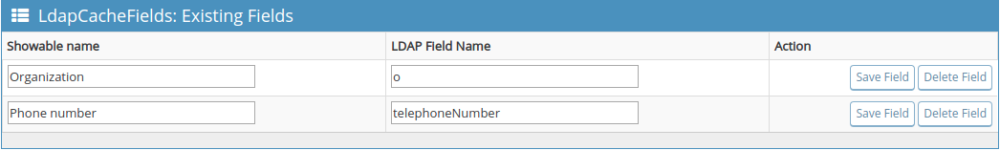

# LDAP Cache Fields plugin for MantisBT

Copyright (c) 2020 Association Cocktail, Marc-Antoine TURBET-DELOF

## Description

_LdapCacheFields_ is a plugin for [MantisBT](http://mantisbt.org) that 
allows the administrator to add some LDAP fields to in cached users attributes.

## Installation

### Requirements

The plugin requires this [MantisBT pull request](https://github.com/mantisbt/mantisbt/pull/1660).

### Setup Instructions

1. Download or clone a copy of the 
   [plugin's code](https://github.com/Association-Cocktail/LdapCacheFields).
2. Copy the plugin (the `LdapCacheFields/` directory) into your Mantis
   installation's `plugins/` directory.
3. While logged in as an administrator, go to *Manage → Manage Plugins*.
4. In the *Available Plugins* list, you'll find the *LdapCacheFields* plugin;
   click the **Install** link.
5. In the *Installed Plugins* list, click on the **LdapCacheFields** plugin to configure it.

## Configuration

The list of additional user's attributes from LDAP fields can be defined on the plugin's config page.

Specify, for each field, the showable name. It will be displayed in profile user page.

## Screen Shots

## Support

If you wish to file a
[bug report](https://github.com/Association-Cocktail/LdapCacheFields/issues/new),
or have questions related to use and installation, please use the plugin's
[issues tracker](https://github.com/Association-Cocktail/LdapCacheFields/issues)
on GitHub.

All code contributions (bug fixes, new features and enhancements, translations) 
are welcome and highly encouraged, preferably as a
[Pull Request](https://github.com/Association-Cocktail/LdapCacheFields/compare).

The latest source code is available on
[GitHub](https://github.com/Association-Cocktail/LdapCacheFields).
